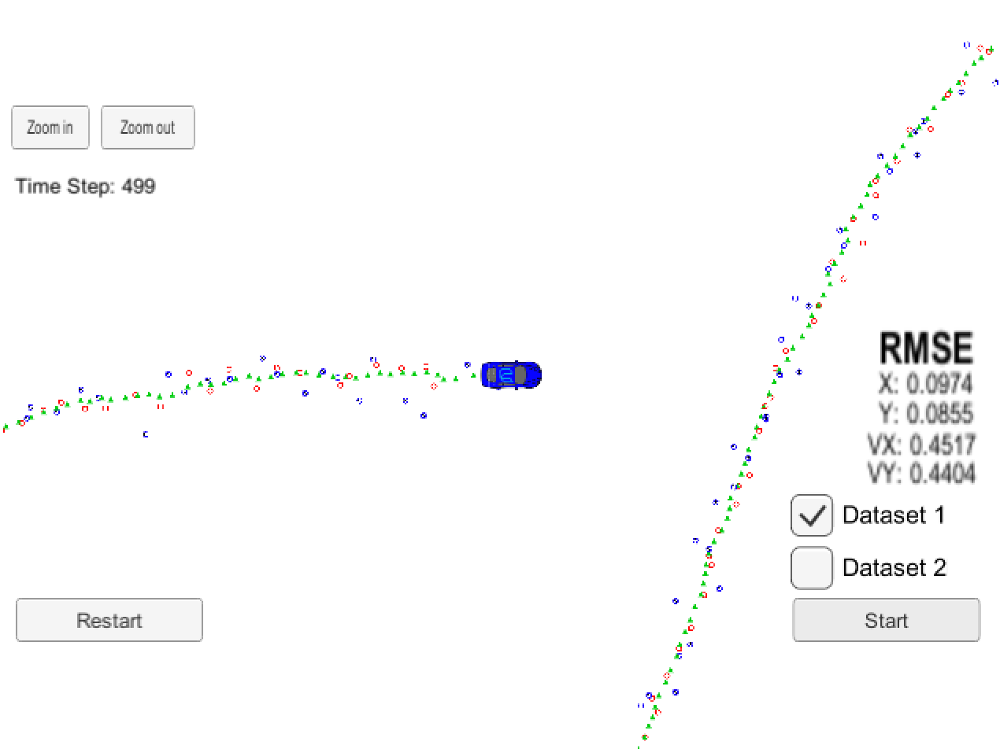
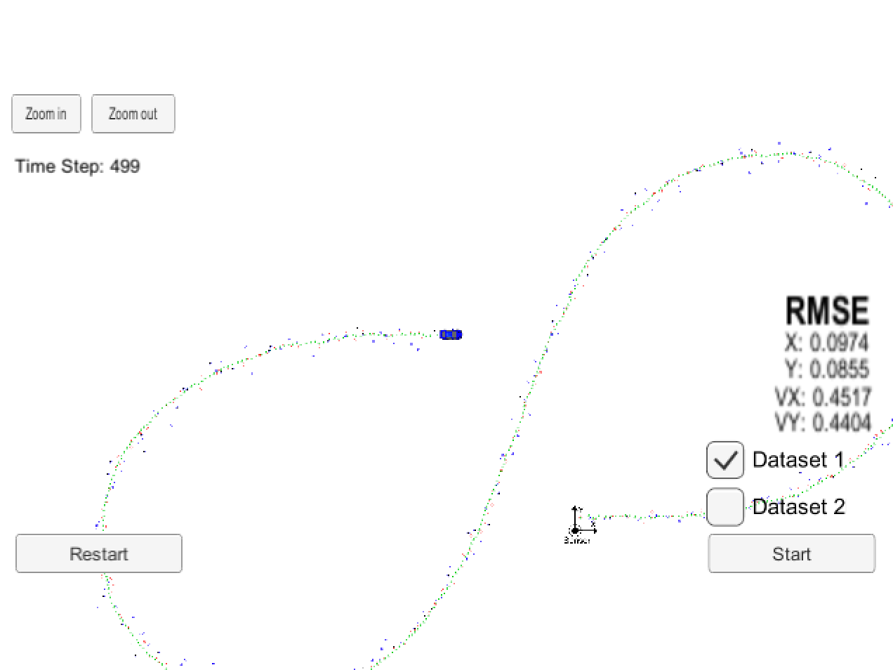
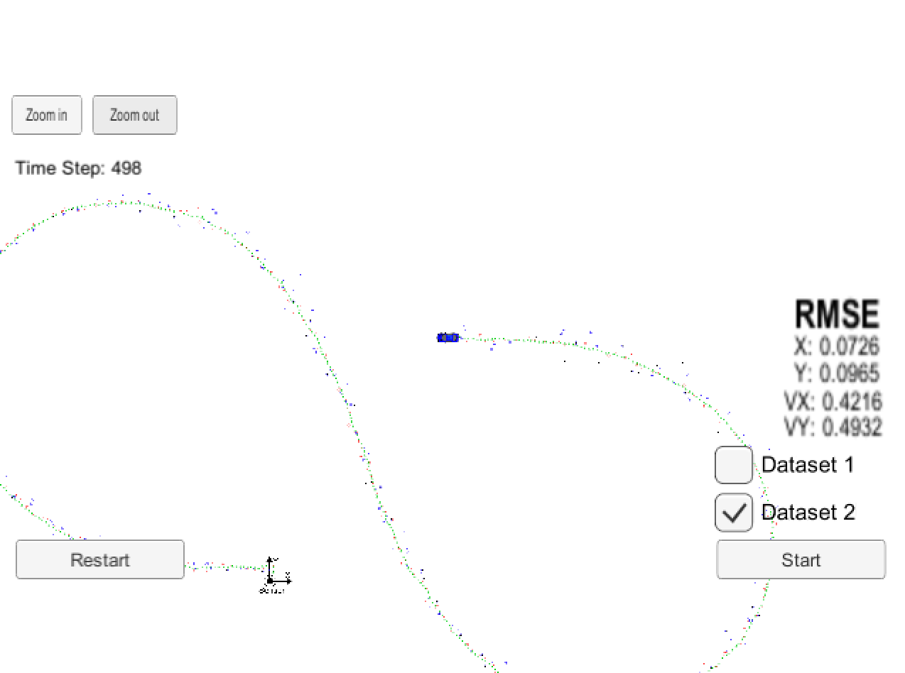

# Extended Kalman Filter Project Starter Code
Self-Driving Car Engineer Nanodegree Program

This project implements an extended Kalman filter in C++.

Input data consisting of laser measurements (given directly as x and y positions, with some known uncertainty) and radar measurements (given as radius, angle, and radial velocity relative to some fixed measurement site, with some known uncertainty) are combined with a motion model to track a vehicle with much better accuracy than the individual measurements alone allow.

This project involves the Term 2 Simulator which can be downloaded [here](https://github.com/udacity/self-driving-car-sim/releases)

## Content of this repo
- `scr` a directory with the project code:
  - `main.cpp` - reads in data, calls a function to run the Kalman filter, calls a function to calculate RMSE
  - `FusionEKF.cpp` - initializes the filter, calls the predict function, calls the update function
  - `kalman_filter.cpp`- defines the predict function, the update function for lidar, and the update function for radar
  - `tools.cpp` - a function to calculate RMSE and the Jacobian matrix

## Basic Build Instructions

1. Clone this repo.
2. Make a build directory: `mkdir build && cd build`
3. Compile: `cmake .. && make` 
   * On windows, you may need to run: `cmake .. -G "Unix Makefiles" && make`
4. Run it: `./ExtendedKF `

## Results

The Kalman filter does a good job of tracking the car's position with significantly reduced noise.

- Red circles are lidar measurements, 
- Blue circles are radar measurements (position markers inferred from radius and angle; the also-supplied radial velocity measurements are not shown).
- Green markers are the car's position as estimated by the Kalman filter. 

### Dataset 1

Accuracy - RMSE: [0.0974, 0.0855,  0.4517,  0.4404]

### Dataset 2

Accuracy - RMSE: [0.0726, 0.00965,  0.4216,  0.4932]

